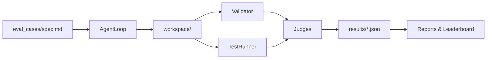

# Vibe Code Bench

**Evaluate how well AI models can build complete, working applications from natural language prompts.**

Vibe Code Bench tests whether AI coding assistants can take casual requests like "Build me a Pomodoro timer" and produce fully functional, self-contained applications that actually work.

## Repository Overview

Vibe Code Bench is a benchmark harness for evaluating Large Language Models (LLMs) on "vibe coding" tasks—building complete applications from natural language specifications. It runs **multi-turn agentic coding sessions** where models use tools (file operations, test execution, code reading) to iteratively build solutions, then validates, tests, judges, and reports on the results.

The framework is designed for:
- **Benchmarking** LLM coding capabilities across diverse application types
- **Comparing** multiple models on the same tasks with objective scoring
- **Analyzing** agent behavior (tool use, iteration patterns, error recovery)
- **Reproducible evaluation** with standardized constraints and judging

All models route through [OpenRouter](https://openrouter.ai/) using a single API key, enabling fair comparisons across providers (Anthropic, OpenAI, Google, etc.).

## How an Evaluation Run Works

An evaluation executes the following pipeline for each model × case combination:



1. **Case Selection** – Load task specifications from `eval_cases/*/spec.md` (natural language descriptions). Optional `tests.py` files define functional tests.

2. **Agent Loop Execution** – Run a multi-turn coding session (`vibe_eval/agent_loop.py`) where the model:
   - Receives the task specification as context
   - Uses tools: `write_file`, `read_file`, `run_command`, `run_tests`, etc.
   - Writes code into a per-run workspace directory
   - Can iterate, fix errors, and refine the solution

3. **Sandbox Execution** – Execute generated commands in a sandboxed environment with dependency enforcement (`vibe_eval/sandbox/executor.py`). Package installs are blocked to ensure self-contained outputs.

4. **Execution Validation** – Verify that generated code runs without errors (`vibe_eval/sandbox/validator.py`). This includes checking for syntax errors, runtime exceptions, and proper exit codes.

5. **Functional Testing** – Run test suites (`vibe_eval/sandbox/test_runner.py`) when `tests.py` files exist. For web apps, Playwright is used to validate UI behavior when available.

6. **Scoring via Judges** – Evaluate outputs using LLM judges:
   - **Single-judge mode**: One model scores each dimension (executes, features, quality, etc.)
   - **Multi-judge arbitration (default)**: Multiple judges score independently, then aggregate results for reduced bias
   - Judge logic: `vibe_eval/judge/*` (absolute scoring, comparative, multi-judge)

7. **Report Generation** – Compile results into JSON (`results/TIMESTAMP_results.json`) and generate markdown reports/leaderboards (`vibe_eval/reporting/*`, `generate_report.py`)

## Key Modules

| Module | Purpose |
|--------|---------|
| `vibe_eval/cli.py` | CLI commands (`run`, `show`, `diagnose`, `list-cases`, `dashboard`, `list-models`) |
| `vibe_eval/runner.py` | Main orchestration: models × cases × judging coordination |
| `vibe_eval/agent_loop.py` | Multi-turn tool-using coding session loop with metrics tracking |
| `vibe_eval/models/openrouter.py` | Model adapter for OpenRouter (all models route through this) |
| `vibe_eval/sandbox/executor.py` | Sandboxed command execution with dependency enforcement |
| `vibe_eval/sandbox/validator.py` | Execution validation (syntax, runtime errors, exit codes) |
| `vibe_eval/sandbox/test_runner.py` | Functional test execution (Playwright for web apps when available) |
| `vibe_eval/judge/absolute.py` | LLM judges scoring execution, features, quality, etc. |
| `vibe_eval/judge/multi_judge.py` | Multi-judge arbitration for reduced bias |
| `vibe_eval/scoring/aggregator.py` | Score aggregation (auto, static, judge-based) |
| `vibe_eval/reporting/leaderboard.py` | Leaderboard generation and reporting |
| `eval_cases/` | Benchmark tasks: each case has `spec.md` and optional `tests.py` |

## Try It Without Reading the Code

Get started in 3 commands (no code inspection required):

```bash
# 1. Set your OpenRouter API key (only key you need - all models route through OpenRouter)
echo "OPENROUTER_API_KEY=your-key-here" > .env

# 2. List available evaluation cases
python -m vibe_eval list-cases

# 3. Run one model on one case (example: claude-sonnet-4.5 on the Pomodoro timer)
python -m vibe_eval run -m claude-sonnet-4.5 -c case_01_pomodoro

# 4. View the results
python -m vibe_eval show results/*_results.json
```

For a full benchmark on multiple models:
```bash
python -m vibe_eval run -m "claude-opus-4.5,gpt-4o,gemini-2.5-pro" -c all
```

That's it! The framework handles agent loops, sandbox execution, validation, testing, judging, and reporting automatically.

## Latest Results

**Evaluation Date:** January 29, 2026  
**Models Tested:** 11 models across 30 cases

| Rank | Model | Average Score | Avg Time (s) | Avg Tokens | Total Cost |
|------|-------|---------------|--------------|------------|------------|
| 1 | `claude-opus-4.5` | **83.9** | 75.5 | 7,996 | $5.55 |
| 2 | `gpt-5.2` | **81.8** | 103.9 | 8,769 | $3.43 |
| 3 | `gemini-3-pro-preview` | **79.8** | 80.9 | 9,403 | $3.96 |
| 4 | `glm-4.7` | **79.7** | 145.0 | 7,687 | $0.24 |
| 5 | `kimi-k2.5` | **79.2** | 159.3 | 8,764 | $0.59 |
| 6 | `claude-sonnet-4.5` | **78.1** | 68.5 | 7,040 | $2.89 |
| 7 | `gpt-5.2-codex` | **77.5** | 45.0 | 3,973 | $1.01 |
| 8 | `gemini-3-flash-preview` | **77.4** | 19.9 | 4,194 | $0.32 |
| 9 | `minimax-m2.1` | **77.4** | 124.1 | 35,309 | $0.51 |
| 10 | `qwen3-coder` | **72.6** | 58.4 | 6,320 | $0.16 |
| 11 | `trinity-large-preview:free` | **62.8** | 71.1 | 9,632 | $0.00 |

*See [BENCHMARK_REPORT_11MODELS.md](BENCHMARK_REPORT_11MODELS.md) for detailed case-by-case breakdown.*

## Quick Start

### 1. Install

```bash
# Clone or navigate to the repository
cd vibe-code-bench

# Install in editable mode
pip install -e .
```

### 2. Set Up API Keys

```bash
# Copy the example environment file
cp .env.example .env

# Edit .env and add your OpenRouter API key
# This is the ONLY key you need - all models route through OpenRouter
```

**Required:**
- `OPENROUTER_API_KEY` - Used for all models and judges via OpenRouter

**Note:** All models (Claude, GPT, Gemini, etc.) are accessed through OpenRouter using this single API key. You don't need separate keys from individual providers.

### 3. Run Your First Evaluation

```bash
# Test a single model on a single case
python -m vibe_eval run -m claude-sonnet-4.5 -c case_01_pomodoro

# Compare two models on all cases
python -m vibe_eval run -m claude-opus-4.5,gpt-4o -c all

# Run multiple models
python -m vibe_eval run -m "claude-opus-4.5,claude-sonnet-4.5,gpt-4o" -c all
```

### 4. View Results

Results are saved to `results/TIMESTAMP_results.json`. You can:

```bash
# View summary in terminal
python -m vibe_eval show results/20260128_210319_results.json

# Generate a markdown report
python generate_report.py results/20260128_210319_results.json -o REPORT.md
```

## Understanding Model Names

Models are specified using their full OpenRouter ID format:

```bash
# Anthropic models
anthropic/claude-opus-4.5
anthropic/claude-sonnet-4.5

# OpenAI models
openai/gpt-5.2
openai/gpt-5.2-codex
openai/gpt-4o

# Google models
google/gemini-3-flash-preview
google/gemini-3-pro-preview

# Other providers
moonshotai/kimi-k2.5
z-ai/glm-4.7
qwen/qwen3-coder
minimax/minimax-m2.1
```

You can also use shorthand names (they'll be converted automatically):
- `claude-opus-4.5` → `anthropic/claude-opus-4.5`
- `gpt-4o` → `openai/gpt-4o`

## Evaluation Cases

Vibe Code Bench includes **30 evaluation cases** across three tiers:

### Tier 1: Simple Web Apps (Cases 1-15)
Basic applications that test core coding ability:
- Pomodoro Timer, Quiz App, Calculator, Notes App, Weather Dashboard
- Kanban Board, Stopwatch, Typing Test, Expense Tracker, Memory Game
- Color Palette Generator, Habit Tracker, Password Generator, Unit Converter, Markdown Editor

### Tier 2: Developer Tools (Cases 16-20)
Tools that process data or generate outputs:
- Repo Stats Infographic, Legal Case Search, Slide Summary Reporter
- Project Control Center, Log Analytics Dashboard

### Tier 3: Complex Applications (Cases 21-25)
Multi-feature apps requiring proper architecture:
- Spreadsheet (with formulas), Flowchart Editor, Rich Text Editor
- File Browser, Data Visualization Dashboard

### Tier 4: Agentic Tasks (Cases 31-35)
Multi-step tasks requiring planning and iteration:
- API Integration, Debug Session, Refactor, Test-Driven Development, Data Pipeline

**View all cases:**
```bash
python -m vibe_eval list-cases
```

**See detailed requirements:**
See [CASES.md](CASES.md) for full specifications and scoring criteria.

## Command Reference

### Running Evaluations

```bash
# Run specific cases
python -m vibe_eval run -m claude-sonnet-4.5 -c case_01_pomodoro,case_02_quiz

# Run all cases
python -m vibe_eval run -m gpt-4o -c all

# Custom timeout (default is 20 minutes per case)
python -m vibe_eval run -m gpt-4o -c all -t 15

# Fast suite mode (subset of high-signal cases)
python -m vibe_eval run -m gpt-4o -c all --suite fast
```

### Viewing Results

```bash
# List available result files
ls results/*.json

# Show summary
python -m vibe_eval show results/TIMESTAMP_results.json

# Generate markdown report
python generate_report.py results/TIMESTAMP_results.json -o REPORT.md
```

### Other Commands

```bash
# List all available cases
python -m vibe_eval list-cases

# View detailed diagnostics
python -m vibe_eval diagnose --results-dir results --output-dir reports
```

## Understanding Scores

Each model receives a score from 0-100 based on:

- **Executes** (25%) - Does the code run without errors?
- **Features Complete** (30%) - Are all required features implemented?
- **Output Quality** (20%) - How polished is the result?
- **Direction Following** (10%) - Did it build what was asked?
- **Code Quality** (15%) - Is the code well-written?

**Execution Gate:** If code doesn't execute properly (executes score < 3), the total score is capped at 30 points.

## Results Structure

After an evaluation completes, you'll find:

1. **Results JSON** (`results/TIMESTAMP_results.json`)
   - Contains all scores, metrics, and comparisons
   - Includes leaderboard rankings
   - Has detailed per-case breakdowns

2. **Generated Code** (`results/TIMESTAMP/case_name/model_id/`)
   - All code files created by each model
   - You can inspect these to see what was generated

3. **Report** (if generated)
   - Markdown summary with leaderboard and case breakdown
   - Easy to share or include in documentation

## Example Workflow

```bash
# 1. Install and configure
pip install -e .
cp .env.example .env
# Edit .env with your API key

# 2. Run a quick test
python -m vibe_eval run -m claude-sonnet-4.5 -c case_01_pomodoro

# 3. Check results
python -m vibe_eval show results/*.json | head

# 4. Run full evaluation
python -m vibe_eval run -m "claude-opus-4.5,gpt-4o,gemini-3-flash-preview" -c all

# 5. Generate report
python generate_report.py results/LATEST_results.json -o BENCHMARK_REPORT.md
```

## Adding Your Own Cases

Create a new folder in `eval_cases/`:

```
eval_cases/
└── case_XX_myapp/
    ├── spec.md          # Natural language task description
    └── tests.py         # Functional tests (optional but recommended)
```

The `spec.md` should describe what you want built in plain English. The `tests.py` file uses Playwright to test the generated application.

See existing cases in `eval_cases/` for examples.

## Troubleshooting

**"OPENROUTER_API_KEY not set"**
- Make sure you've created `.env` from `.env.example` and added your key

**Model not found**
- Check the model ID format (should be `provider/model-name`)
- Use `python -m vibe_eval list-models` to see available models

**Evaluation hangs or times out**
- Increase timeout with `-t` flag: `python -m vibe_eval run -m model -c case -t 30`
- Check API key limits and rate limits

**Results file not created**
- Evaluations write results only at the end (by design)
- If interrupted, check `results/TIMESTAMP/` directories for partial outputs

## Project Structure

```
vibe-code-bench/
├── vibe_eval/           # Core evaluation framework
│   ├── cli.py          # Command-line interface
│   ├── runner.py       # Main evaluation orchestrator
│   ├── agent_loop.py   # Multi-turn agent interaction
│   ├── judge/          # Scoring judges
│   ├── models/         # Model adapters
│   └── sandbox/        # Code execution and validation
├── eval_cases/         # Evaluation cases (30 total)
│   └── case_XX_name/
│       ├── spec.md     # Task specification
│       └── tests.py    # Functional tests
├── results/            # Evaluation results
└── tests/              # Unit tests for framework
```

## Learn More

- **[CASES.md](CASES.md)** - Detailed case descriptions and requirements
- **[AGENTS.md](AGENTS.md)** - Development guidelines and project structure
- Check `results/` directory for example outputs from previous runs

## License

MIT
